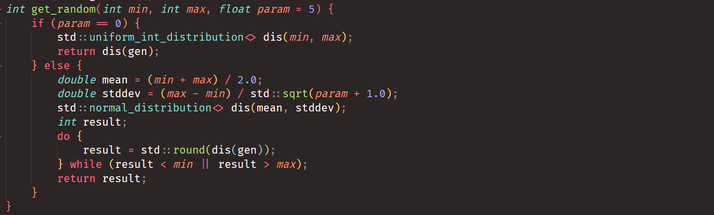

## 四子棋实验报告

曾冠宁 2021010

### 算法

#### 蒙特卡洛树搜索

蒙特卡罗树搜索（Monte Carlo Tree Search，MCTS）是一种用于决策过程中的启发式搜索算法，特别适用于博弈和规划问题。MCTS的基本思想是通过模拟未来可能的结果来选择最佳行动。其核心步骤包括： 

1. **选择（Selection）** ：从根节点开始，根据特定的策略选择子节点，直到到达未完全展开的节点。 
2. **扩展（Expansion）** ：从选择的节点生成一个或多个子节点。 
3. **模拟（Simulation）** ：从新扩展的节点开始，进行一次模拟，通常是随机模拟直到终局。 
4. **反向传播（Backpropagation）** ：将模拟结果反向传播到所有经过的节点，更新它们的统计信息。

下面是步骤1-4的流程图：

#### 上置信界

在选择步骤中，MCTS使用上置信界（Upper Confidence Bound, UCB1）算法来平衡探索（exploration）和利用（exploitation）。UCB1公式如下：

$$
UCB1= \frac{W_i}{n_i} + c \sqrt{\frac{\ln N}{n_i}}
$$
其中： 
- $W_i$ 是节点 $i$ 的总奖励。 
- $n_i$​ 是节点 $i$ 被访问的次数。 
- $N$ 是父节点被访问的总次数。 
- $c$ 是一个超参数，用于调整探索和利用的权衡。

UCB1通过在每次选择时考虑节点的平均奖励（利用）和节点的访问次数（探索），有效地在已知的好选择和潜在的好选择之间进行平衡。

### 工程实现

在四子棋问题中，可以将每个游戏状态即为蒙特卡洛树的一个结点，将某一个游戏状态可能演变成的下一个状态记为原来的状态的子结点。在结点中，需要存储棋盘内容，上一步的操作，棋局胜负状况，父结点和子结点的指针，以及结点访问次数和总奖励值，如下：

每次决策时，从根结点出发，循环进行selection, expansion, simulation和backpropagation的过程。如下：

1. 运行时间限制：考虑到3秒的时间限制，设计`time_constrait = 2.7`，表示循环的时间到达2.7秒则退出并返回。经充分测试，`time_constrait = 2.7`可以稳定保证总推理时间不超出限制。

2. c值的选取：UCB1的计算中，c的值越大，表示搜索越偏向广度优先，c的值越小，表示越偏向深度优先。经过一定的尝试，我将c的值固定为1左右。

3. 子树动态维护：棋局不断进行，相当于从树根不断向下行走。考虑到空间限制，我在`MCTNode` 中增加了静态成员变量 `sub_tree`，并修改了析构函数，使得当从树根开始递归析构时，遇到`subtree`停止。通过这种方式动态释放不使用的结点，并将子树保留在后续的游戏步继续使用。

4. 关键操作判定：注意到Agent偶尔会忽略自己或对方一步取胜的行棋方法，而执行了其他的不关键操作。为简化计算，首先判定是否有这样的关键操作，如果没有，则按照原定的MTCS过程进行，如果有，则返回关键操作的同时，依然将3秒的时间充分利用，在以关键操作为根的子树中进行MTCS，提前为后面的行棋提供更充分的计算。

5. 随机数分布：在原来的UCB1计算中，靠近边缘的行棋和靠近中间的行棋在其他条件相同时有相同的UCB1值。考虑到在中间行棋具有更大的长期收益，修改随机数生成器，为靠近中间的行棋提供更高的概率，便于算法模拟时更充分关注探索靠近中间的子结点。

6. 奖励设计：在最初实现中，如果模拟结果是己方获胜，那么backpropagation将回溯到的每个结点都加1，否则都减1，却发现评测时胜率只有40%。之后将奖励机制更新方式做修改：如果回溯到的结点是己方结点，则还是己方获胜时加1，落败时减1，如果是敌方结点，则己方获胜时反而要减1，落败时给对方加1。经测试，胜率提高为94%。

   这是因为按照过去的奖励机制，敌我双方的目标都是让己方获胜。这导致敌方并不是要自己获胜，而是要送己方获胜。相比之下，修正后的奖励鼓励双方相互竞争获胜，充分模拟了强对抗性的环境。

### 实验结果

在线测试中取得94%胜率，94胜0平6负：

### 实验总结

本次实验提高了自己对蒙特卡洛搜索树和上置信界的算法的理解和认识，并且在模型调试中更加熟悉了C++程序的动态内存管理机制以及面向对象程序设计的语法细节以及调试方法。

